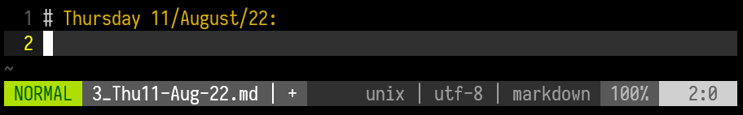

# Diary Notes: LaTeX template

This template aims to agile the process of take daily notes, personal
diary, etc. All the entries are intended to be written in `Markdown`,
the LaTeX template is completely automated through a `Makefile`.


## Download

To get locally this template you could run
```bash
svn export https://github.com/DanEscher98/Escritos/trunk/Templates/DiaryNotes
```

If you hadn't installed the `svn` command, simply type `sudo apt -y install
subversion`


## Usage

To create your first note, just type `make note` and it will create a
`Markdown` file with the current date as name and at the header.



## Dependencies

Its supposed that you had `pdflatex` command in your `Linux` distro.
Although theoretically it could run on a `Windows` machine doing minor
changes on the script, this has not been tested. Simply type
```bash
sudo apt -y install texlive-full
```
in order to get the full `LaTeX` experience.


## Common troubleshooting

If for some reason the `make` fails at the `pdflatex` compilation
step, all the files at `pages/` will be left renamed with just its
position number. To restore the full name, just run

```bash
bash -c "source format.sh; restore_name"
```
